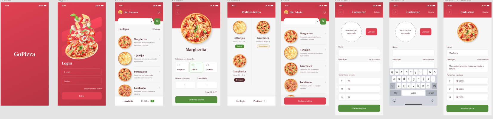

<h1 align="center">
  gopizza
</h1>

<h4 align="center">App desenvolvido em React Native</h4>

**Link Figma:** https://www.figma.com/file/A5sH4RjXID4cCw1GK9FNgm/GoPizza-Ignite

## :rocket: Como executar

<ul>
  <li>Para rodar o projeto é necessário configurar o firebase!</li>
  <li>No diretório raiz, executar o comando yarn pra instalar as dependências do projeto</li>
  <li>Na pasta raiz executar yarn start</li>
  <li>Em outra janela do terminal, também na pasta raiz executar yarn android</li>
</ul>

## :speech_balloon: Funcionalidades

<ul>
  <li>Autentição de usuário como admin ou garçom</li>
  <li>Envio de Link ao email caso o usuário esqueça a senha</li>
  <li>Adicionar novos sabores de pizza ao cardápio, que ficará salvo no firebase</li>
  <li>Adicionar imagem da pizza no cardápio utilizando o Image Picker</li>
  <li>Através do cardápio, criar um novo pedido, que também ficara salvo no firebase</li>
</ul>

## :iphone: Recursos Aplicados

<ul>
  <li>Navegação entre páginas</li>
  <li>Async Storage (Banco de dados local)</li>
  <li>Styled Components</li>
  <li>Firebase: auth, firestore, storage</li>
  <li>Lottie</li>
</ul>

## ⌨️ Tecnologias

<ul>
  <li>React Native</li>
  <li>Firebase</li>
  <li>TypeScript</li>
  <li>Expo</li>
  <li>Image-picker</li>
</ul>